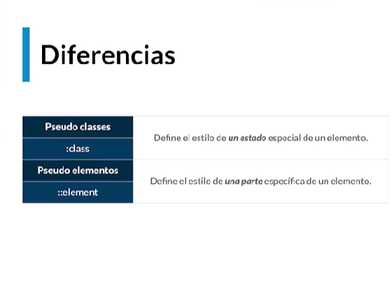

# ☮ Pseudo clases y pseudo elementos


### Cómo nombrar las clases

[Metodología \*\*BEM](https://www.youtube.com/watch?v=wDUwGo98JTA\&feature=youtu.be)😗\* cómo nombrar correctamente las clases.

Solo usa **clases**. Las nombra siguiendo el siguiente patrón: **BLOQUE\_\_ELEMENTO—MODIFICADOR** (son 2 guiones, se usa 1 guión para separar palabras).

* **Bloque:** sección que puede funcionar por sí sola.
* **Elemento:** forma una de las partes del bloque.
* **Modificador:** variaciones de un mismo bloque/elemento.

```html
<!-- BLOQUE -->
<main class="Padre">
	<!-- BLOQUE__ELEMENTO --> 
	<section class="Padre__Hijo">
		<!-- BLOQUE__ELEMENTO--MODIFICADOR -->
		<article class="Padre__Hijastro--Mayor"></article>
		<article class="Padre__Hijastro--Menor"></article>
	</section>
 </main>
```

### Crear estilos a etiquetas dentro de clases

Si tienes etiquetas **dentro** de la etiqueta a la que le estás aplicando estilos y le pones una clase, puedes aplicar estilos únicamente a las etiquetas dentro de esa clase de la siguiente manera: `.clase etiqueta {}`

```css
/* Estilos a etiqueta "a" dentro de una clase */
.main-nav__item a {
    color: white;
}
```

> Usa `background-color` para ver las cajas de los elementos.

### Pseudo clases

Define el estilo de un estado especial de un elemento.

Agregar al final de la clase `:nombreAccion`

```css
/* Pseudo clase */
.main-nav__item a:hover {
    color: darkblue;
}

.main-nav__item a:active {
    color: darkcyan;
}
```

[Lista de Pseudo Clases](https://developer.mozilla.org/es/docs/Web/CSS/Pseudo-classes)

### Pseudo Elementos

Define el estilo de una parte específica de un elemento.

Agregar al final de la clase `::nombreAccion`

```css
/* Pseudo elemento */
.main-nav__item a::after {
    content: " | "; /* despues del elemento, agrega esto */
}
```


